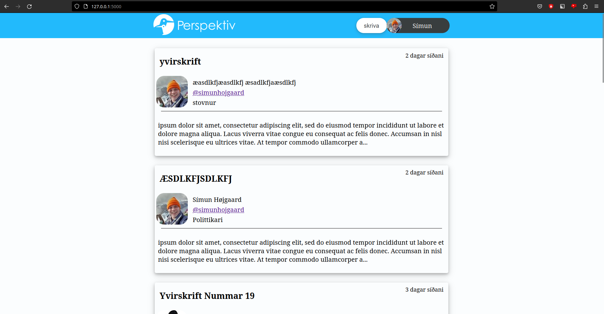

# 
This project was a way for me to learn how webdevelopment works. It allowed me to experiment with:
* flask and jinja2 templating
* fun stuff with databases :D
* html, css and javascript
* deployment via:
    * docker build
    * pip environments

Website is just a simple website that lets you post and view letters.(skrivarabrøv) as we call them where i come from.
My goal was to write something beautiful with as little code as possible. Although this is still very much working progress.

### My plan is to include these extra features as time goes:
- [x] styled page for each letter
- [x] Letter verification via SMS
- [X] scroll and load more content on frontpage
- [x] picture compression to save some space
- [x] Very fancy fitting logo (thank you Matteus)
- [x] Include login/user session logic
- [ ] reorganize all the routes... arrghhh
- [ ] About me settings page
- [ ] profile link logic
- [ ] personal profile page
- [ ] public profile page
- [ ] edit/delete articles feature
- [ ] search function on front page
- [ ] agree/disagree on articles (Really need to rethink how this should work, could be a dangerous part of the website, need to be careful)
- [ ] reply to artilce 
- [ ] comment on article (yeah about this,,,, also contriversial)

# installation guides
## Install via docker

### You can test the app with following quick setup:
* build container `docker build -t perspektiv:latest github.com/simuns/perspektiv`
* activating container `docker run --rm -p 5000:5000 perspektiv`
---
### A more production ready setup with data mount.
* clone `git clone https://github.com/simuns/perspektiv.git`
* change dir `cd perspektiv`
* Then wallah `docker-compose up -d`

## Install via pipenv

* clone and enter the project 
    * `git clone https://github.com/simuns/perspektiv.git`
    * `cd perspektiv`
* install dependencies to git environment `pipenv install`
* activate environment `pipenv shell`
    * `cd src/webapp/`
* run webserver `flask run`
